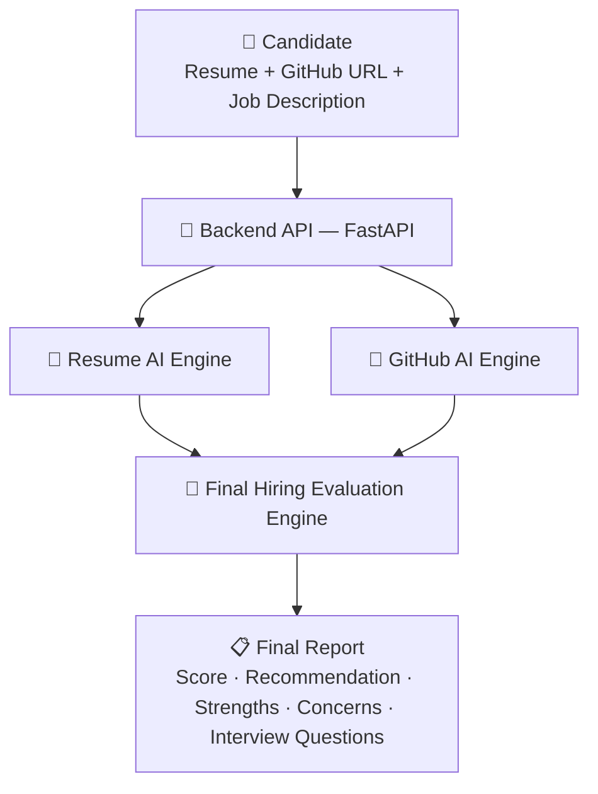

<div align="center">

# 🚀 TalentFlow AI

### AI-Powered Hackathon & Hiring Evaluation Platform

**Automating the first round of technical screening — resumes and GitHub repositories — using LLMs.**

[](https://fastapi.tiangolo.com/)
[](https://www.python.org/)
[](https://ai.google.dev/)
[](https://docs.pydantic.dev/)
[]()

</div>

---

## 🎯 The Problem

Imagine a hackathon with **300+ teams** and only **3–4 judges**.

Every team submits a resume and a GitHub repository. Judges have to manually open each one, read the code, evaluate the project, and decide who gets shortlisted — a process that can take **hours**, and simply doesn't scale.

This isn't just a hackathon problem. It's a **real hiring problem** — every campus placement drive, internship pipeline, and technical screening round hits the same wall: **too many candidates, too little judge time.**

## 💡 The Solution

**TalentFlow AI** acts as an automated **"Round 0" judge.**

It reads every resume and every GitHub repository using AI, compares them against a job description or problem statement, and instantly produces a score, a shortlist decision, strengths, gaps, and even **auto-generated interview questions** — so human judges only spend time on candidates who've already cleared AI-driven technical screening.

> ✅ **A practical, real-world AI system** — not just a chatbot wrapper. It solves an actual bottleneck faced by recruiters, hackathon organizers, and hiring teams.

---

## 🧭 How It Works

```
📄 Resume  ──┐
             ├──►  🤖 AI Analysis  ──►  📊 Score  ──►  ✅ Shortlist Decision
🐙 GitHub  ──┘
```

A candidate submits their **resume** and **GitHub link** once — everything after that happens automatically.

---

## 🏗️ High-Level Architecture



One request in → one complete hiring report out.

---

## ⚙️ The Two AI Engines

<table>
<tr>
<th>📄 Resume Engine</th>
<th>🐙 GitHub Engine</th>
</tr>
<tr>
<td>

```
Resume (PDF)
     │
     ▼
Extract text (PyMuPDF)
     │
     ▼
AI extracts skills,
projects, experience
     │
     ▼
AI evaluates vs. job
description → Score
```

</td>
<td>

```
GitHub Repository URL
     │
     ▼
Clone repo (GitPython)
     │
     ▼
Read important files,
ignore noise
     │
     ▼
AI evaluates architecture,
code quality → Score
```

</td>
</tr>
</table>

Both engines run **independently and in parallel**, then feed into the **Final Hiring Evaluation Engine**, which combines both scores with the job description to produce one unified decision.

---

## 🧠 Two-Stage AI Pipeline

A key design choice: **extraction** and **evaluation** are deliberately kept separate.

| Stage | What it does |
|---|---|
| **1️⃣ Extraction** | Resume / repo → **facts only** (structured JSON). No opinions, no scoring. |
| **2️⃣ Evaluation** | Facts + job description → **opinions** (scores, strengths, gaps, recommendation). |

**Why?** If the job description changes, only Stage 2 re-runs — the expensive extraction step doesn't need to repeat. Cheaper, faster, and easier to reason about.

---

## ✨ Key Features

- 📄 **Resume Intelligence** — extracts candidate info, education, experience, projects, and categorized skills (languages, frameworks, databases, cloud, AI/ML)
- 🐙 **GitHub Repository Analysis** — clones and reads real source code to evaluate architecture, tech stack, and code quality
- ⚖️ **AI Hiring Decision Engine** — combines both analyses into one score, a shortlist recommendation, and tailored interview questions
- 🔌 **Provider-agnostic AI layer** — all LLM calls go through a single `GeminiService` abstraction, so swapping to another model later means changing one file
- 🧱 **Schema-constrained outputs** — every AI response is validated against a Pydantic model, so malformed output fails fast instead of corrupting data
- ⚡ **Built for speed** — resume and GitHub analysis run concurrently via `asyncio.gather()`

---

## 🛠️ Tech Stack

| Layer | Technology | Why |
|---|---|---|
| API Framework | **FastAPI** | Async-native, auto-generated docs, tight Pydantic integration |
| LLM | **Google Gemini** | Strong structured-output support, fast & low-cost |
| Validation | **Pydantic** | Type-safe schemas for every AI response |
| PDF Parsing | **PyMuPDF** | Fast, accurate text extraction |
| Repo Access | **GitPython** | Simple, scriptable repository cloning |
| Config | **pydantic-settings** | Type-validated env vars, fails fast on missing config |
| Database *(planned)* | **PostgreSQL + SQLAlchemy** | Persist candidates, submissions & evaluation history |
| Frontend *(planned)* | **React** | Candidate / Judge / Organizer dashboards |

---

## 📁 Project Structure

```
talentflow-ai/
└── app/
    ├── api/            → routers (HTTP layer)
    ├── services/        → business logic
    │     gemini_service.py
    │     resume_extraction_service.py
    │     resume_evaluation_service.py
    │     github_service.py
    │     hiring_evaluation_service.py
    │     submission_service.py   ← orchestrator
    ├── schemas/         → Pydantic data contracts
    ├── prompts/         → externalized LLM prompt templates (.txt)
    ├── utils/           → stateless helpers (pdf_parser, prompt_loader)
    ├── core/            → config, logging, exception handling
    └── main.py          → FastAPI entrypoint
```

---

## 📡 API Example

**Request**

```
POST /submission/analyze
Content-Type: multipart/form-data

resume:            resume.pdf
github_url:         https://github.com/username/project
job_description:    "Looking for a Full Stack Developer with AI experience..."
```

**Response**

```json
{
  "resume": { "candidate": {...}, "education": [...], "skills": {...} },
  "resume_evaluation": { "overall_score": 92, "technical_match": 88 },
  "github_analysis": { "tech_stack": [...], "code_quality_score": 90 },
  "hiring_evaluation": {
    "final_score": 90,
    "recommendation": "Shortlist",
    "strengths": ["Strong backend experience", "Excellent project architecture"],
    "concerns": ["Documentation could improve"],
    "interview_questions": [
      "Explain FastAPI dependency injection.",
      "How does JWT authentication work?"
    ]
  }
}
```

---

## 🚀 Getting Started

```bash
# 1. Clone the repository
git clone https://github.com/<your-username>/talentflow-ai.git
cd talentflow-ai

# 2. Create a virtual environment
python -m venv .venv
.venv\Scripts\activate      # Windows
source .venv/bin/activate   # macOS/Linux

# 3. Install dependencies
pip install -r requirements.txt

# 4. Configure environment variables
cp .env.example .env
# add your GEMINI_API_KEY

# 5. Run the server
uvicorn app.main:app --reload
```

Then open **`http://127.0.0.1:8000/docs`** for interactive Swagger API docs.

---

## 🗺️ Roadmap

- [x] FastAPI foundation — config, logging, exception handling
- [x] Gemini AI service abstraction
- [x] Resume extraction & evaluation pipeline
- [x] GitHub repository extraction & evaluation pipeline
- [x] Final hiring evaluation engine
- [x] Unified `/submission/analyze` orchestrator API
- [ ] Parallel processing with `asyncio.gather()`
- [ ] PostgreSQL persistence layer
- [ ] React dashboard (Candidate / Judge / Organizer views)
- [ ] JWT authentication & role-based access
- [ ] Deployment (Render + Vercel)

---

<div align="center">

**TalentFlow AI turns hours of manual screening into seconds of AI-driven insight —**
**a real-world solution for hackathons, campus hiring, and technical recruitment.**

⭐ If you find this project interesting, consider giving it a star!

</div>
